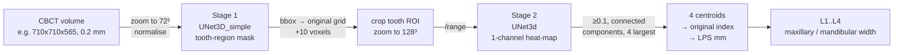

# CBCT landmark detection for measuring basal bone width

Code for

> Dai J, Guo X, Zhang H, Xie H, Huang J, Huang Q, Huang B.
> **Cone-beam CT landmark detection for measuring basal bone width: a retrospective validation study.**
> *BMC Oral Health* 24 (2024). doi:[10.1186/s12903-024-04798-2](https://doi.org/10.1186/s12903-024-04798-2)

A two-stage coarse-to-fine 3-D U-Net pipeline that locates four landmarks on CBCT scans
(L1/L2 = left/right **maxillary**, L3/L4 = left/right **mandibular** basal bone point at the
centre of the root bifurcation) and reports the maxillary width |L1-L2| and mandibular width |L3-L4|.

> **September 2026 re-organisation.** The first upload of this repository was the raw research
> code: files had been renamed on GitHub (`UNet_xhy.py` → `UNet_global.py`, `UNet.py` → `UNet_local.py`,
> `utils_xhy.py` → `utils.py`) without updating the scripts that imported them, every path was
> hard-coded, several scripts were near-duplicate experiments, and the stage-2 training data
> folder (`four_point_save_128`) was produced by code that was commented out. This release puts
> the model code in an importable package, turns every step into a CLI script, adds a single-scan
> `inference.py`, documents the exact preprocessing, and moves the experimental scripts to
> [`legacy/`](legacy/). Network class / parameter names are unchanged from the original code.
> **The paper's trained weights could not be recovered and are not available**, see [Pretrained weights](#pretrained-weights).
> See [File map](#file-map-original--re-organised) for where each old file went.

---

## Contents

1. [Method overview](#method-overview)
2. [Repository layout](#repository-layout)
3. [File map (original → re-organised)](#file-map-original--re-organised)
4. [Installation](#installation)
5. [Pretrained weights](#pretrained-weights)
6. [Inference on new CBCT scans](#inference-on-new-cbct-scans)
7. [Data format](#data-format)
8. [Reproducing the paper (training)](#reproducing-the-paper-training)
9. [Preprocessing and post-processing details](#preprocessing-and-post-processing-details)
10. [FAQ](#faq)
11. [Code vs. paper: known differences and limitations](#code-vs-paper-known-differences-and-limitations)
12. [Citation](#citation)

---

## Method overview



| | Stage 1 (global) | Stage 2 (local) |
|---|---|---|
| class | `cbct_landmark.models.UNet3D_simple` (was `UNet_xhy.UNet3D_simple`) | `cbct_landmark.models.UNet3d` (was `UNet.UNet3d`) |
| input | whole CBCT resampled to **72×72×72** | tooth ROI resampled to **128×128×128** |
| output | sigmoid mask, threshold 0.5 | sigmoid heat-map, **1 channel** containing all 4 landmarks |
| original checkpoint (lost, see [Pretrained weights](#pretrained-weights)) | `tooth_best_model/bestmodel.pth` (plain `state_dict`) | `UNet3d_stage1/Unet_model08.pt` (`{'epoch','state_dict','optimizer_state_dict'}`) |
| parameters | 19.1 M (incl. two unused blocks, see below) | 16.3 M |

Paper results on the 34 test scans: mean radial error 2.00 ± 2.46 mm (L1 2.09, L2 2.30, L3 1.60,
L4 2.02), SDR 71.3 / 81.4 / 86.8 / 91.2 % at 2 / 2.5 / 3 / 4 mm, width error 1.22 ± 1.93 mm
(maxilla) and 0.68 ± 0.82 mm (mandible), CCC 0.96 / 0.98.

## Repository layout

```
cbct_landmark/                  importable package
├── models/
│   ├── layers.py               blocks of the global net            (was utils_xhy.py / utils.py)
│   ├── unet_global.py          UNet3D_simple, UNet3D               (was UNet_xhy.py / UNet_global.py)
│   ├── unet_local.py           UNet3d                              (was UNet.py / UNet_local.py)
│   └── __init__.py             build_global_net / build_local_net / load_checkpoint
├── data/
│   ├── dataset.py              WholeVolumeDataset, LandmarkROIDataset (was SkullWidthCBCT.py)
│   ├── preprocessing.py        range_normalize, quantile_minmax, zoom_to
│   ├── heatmap.py              Gaussian heat-map labels (r=5, σ=2)
│   └── slicer_json.py          read / write 3D Slicer *.mrk.json (LPS)
├── roi.py                      72³ mask → crop box on the original grid and back
├── postprocess.py              heat-map → 4 landmarks → L1..L4 → widths
└── losses.py                   heat-map focal loss                 (was heatmap.py)
scripts/                        one CLI per pipeline step (0 … 6), see "Reproducing the paper"
inference.py                    single-scan end-to-end inference
tests/test_synthetic_roundtrip.py   consistency test, needs no data or weights
weights/                        git-ignored folder for checkpoints you train yourself
legacy/                         original experimental scripts, verbatim, with a README
```

## File map (original → re-organised)

| original file (as imported by the old scripts) | now |
|---|---|
| `UNet_xhy.py` → renamed on GitHub to `UNet_global.py` | `cbct_landmark/models/unet_global.py` (only `UNet3D_simple`, `UNet3D` kept; 2-D / `PreNet` / `MAR_DetNet` / `Classify` were never used by this pipeline and remain in git history) |
| `UNet.py` → renamed on GitHub to `UNet_local.py` | `cbct_landmark/models/unet_local.py` |
| `utils_xhy.py` → renamed on GitHub to `utils.py` | `cbct_landmark/models/layers.py` |
| `SkullWidthCBCT.py` | `cbct_landmark/data/dataset.py` |
| `preprocessing.py` | `cbct_landmark/data/preprocessing.py` |
| `heatmap.py` (focal loss) | `cbct_landmark/losses.py` |
| `filename.py` | `scripts/0_standardize_case_names.py` |
| `1_split_dataset.py` | `scripts/1_split_dataset.py` |
| `tooth_region_pred.py` | `scripts/2_predict_tooth_region.py` |
| crop / heat-map part of `json_process_test0.py` (output folder `four_point_save_128`) | `scripts/3_crop_tooth_roi.py` |
| `2_train_and_valid.py` | `scripts/4_train_landmark.py` |
| `3_test.py` | `scripts/5_test_landmark.py` |
| evaluation part of `json_process_test0.py` / `json_process_test2.py` | `scripts/6_evaluate.py` |
| `json_process.py`, `json_process_test1.py`, `json_process_based_on_nibabel.py`, `json_origin_explain.py`, `image_process.py`, `zoom_in_tooth_image.py`, `sort_landmark.py`, `whole_heatmap_save.py`, `result_process.py`, `transform_to_nii.py` | `legacy/` (unchanged, see [`legacy/README.md`](legacy/README.md)) |
| `tooth_best_model/bestmodel.pth`, `UNet3d_stage1/Unet_model08.pt` | never in git and **no longer available**; see [Pretrained weights](#pretrained-weights) |

## Installation

```bash
git clone https://github.com/Guo777777/CBCT-mandanbular-and-maxillary-Landmark-detection.git
cd CBCT-mandanbular-and-maxillary-Landmark-detection
pip install -r requirements.txt          # torch, numpy, scipy, SimpleITK, scikit-image (+ batchgenerators, tqdm for training)
pip install -e .                         # optional: makes `import cbct_landmark` work anywhere
python tests/test_synthetic_roundtrip.py # sanity check, ~20 s on CPU, no data / weights needed
```

Tested with Python 3.11, PyTorch 2.13, SimpleITK 2.5, scikit-image 0.25 (CPU); the original
experiments used an NVIDIA A100. Any PyTorch ≥ 1.10 should work.

## Pretrained weights

**The trained weights are no longer available.** The two checkpoints used for the paper
(`model/tooth_best_model/bestmodel.pth` for stage 1 and `model/UNet3d_stage1/Unet_model08.pt`
for stage 2) were stored only on the lab server, were never committed to this repository, and
were not archived before that storage was cleared. We have searched our remaining machines and
cannot recover them, so we are unable to share them. We apologise to anyone who hoped to run the
published model directly.

What this means in practice:

* The numbers in the paper cannot be re-run; the *method* can, by retraining on your own annotated
  CBCT data with the scripts in this repository (see [Reproducing the paper](#reproducing-the-paper-training)).
* `inference.py`, `scripts/2_predict_tooth_region.py` and `scripts/5_test_landmark.py` take the
  checkpoints you train yourself. `weights/` is a git-ignored folder you can put them in; any path works.
* **Stage 2** (landmark heat-map network) is fully covered: `scripts/3_crop_tooth_roi.py` builds the
  128³ ROIs and heat-map labels from four 3D Slicer fiducials per case, `scripts/4_train_landmark.py`
  trains `UNet3d`. It needs a coarse tooth mask per case as input (72³ binary, `<case>_pred.nii.gz`).
* **Stage 1** (tooth-region mask) has no training script here (it never existed in this code base).
  Any coarse segmentation of the dentition resampled to 72³ can stand in, e.g. a binary 3-D U-Net
  (`UNet3D_simple` in this package, or nnU-Net) trained on tooth masks; the crop step only uses the
  mask's bounding box dilated by 10 voxels.

`cbct_landmark.models.load_checkpoint()` accepts both a plain `state_dict` and the
`{'epoch','state_dict','optimizer_state_dict'}` dict written by `scripts/4_train_landmark.py`.

## Inference on new CBCT scans

Requires a stage-1 and a stage-2 checkpoint trained by you (the paper's weights are not available).

```bash
python inference.py \
    --image /path/to/scan.nrrd  [more scans ...]  \   # or --input-dir <folder of scans / case folders>
    --global-ckpt weights/tooth_region_bestmodel.pth \
    --local-ckpt  weights/landmark_Unet_model08.pt  \
    --out-dir results/ --save-intermediate
```

Input: any volume SimpleITK can read (`.nrrd`, `.nii(.gz)`, `.mha`, …). Output per scan:

| file | content |
|---|---|
| `<case>_landmarks.mrk.json` | L1..L4 as a 3D Slicer fiducial list (LPS, mm) — drag onto the scan in Slicer |
| `<case>_result.json` | landmarks, maxillary / mandibular width (mm), ROI box, #peaks, warnings |
| `results.csv` | one row per scan |
| `<case>_tooth_mask_72.nii.gz`, `<case>_roi_128.nii.gz`, `<case>_heatmap_128.nii.gz` | intermediates (`--save-intermediate`) |

What the model expects (how the training data looked):

* **Geometry**: head CBCT, voxel ≈ 0.2 mm isotropic, FOV ≈ 14 × 8 cm (Kavo 3D eXami). The
  whole volume is resampled to 72³ and the ROI to 128³, so other voxel sizes / FOVs are not
  fatal, but they are out of distribution; check the intermediates on a few cases first.
* **Orientation**: standard radiological LPS orientation as produced by 3D Slicer / SimpleITK, patient
  upright (maxilla superior to mandible). Coordinates are converted with the image geometry
  (`TransformContinuousIndexToPhysicalPoint`), so origin / spacing / direction in the header are honoured.
  The training data had an identity direction matrix.
* **Intensity**: raw scanner values (HU-like). Normalisation is done inside (see below); do not pre-normalise.
* **Dentition**: permanent dentition with erupted molars (patients aged 10–45 in the paper).

`run_inference(sitk_image, global_net, local_net, device)` in `inference.py` returns the same
information as a dict if you want to call the pipeline from your own code.

## Data format

```
imageStandardData/
└── 001_zhangsan/              <index>_<name>; later scripts use  number, name = case.split('_')
    ├── xxx.nrrd               CBCT volume (any SimpleITK-readable format works)
    ├── F.mrk.json             one 3D Slicer fiducial file per landmark (4 per case),
    ├── F_1.mrk.json           markups[0].coordinateSystem == "LPS", controlPoints[0].position in mm
    ├── ...
train.txt / valid.txt / test.txt   one case id per line
```

Landmarks were annotated in 3D Slicer 5.0.2 by two clinicians (> 5 years' experience) with
consensus review. Any file name is accepted; the L1..L4 identity is assigned from the
coordinates (two most superior points = maxilla; within each jaw the larger L coordinate = left).

## Reproducing the paper (training)

```bash
DATA=/data/SkullWidth            # adjust
# 0. (optional) standardise raw folder names  <Chinese name>  ->  001_<pinyin>
python scripts/0_standardize_case_names.py --src $DATA/raw --dst $DATA/imageStandardData
# 1. 80 / 10 / rest split, seed 2023
python scripts/1_split_dataset.py --data-dir $DATA/imageStandardData --out-dir $DATA
# 2. stage 1: coarse tooth masks (72^3) for every case
python scripts/2_predict_tooth_region.py --data-dir $DATA/imageStandardData \
    --lists $DATA/train.txt $DATA/valid.txt $DATA/test.txt \
    --ckpt weights/tooth_region_bestmodel.pth --out-dir $DATA/tooth_region
# 3. crop the ROI, resample to 128^3, write <case>_image / _heatmap / _roi.json
python scripts/3_crop_tooth_roi.py --data-dir $DATA/imageStandardData \
    --mask-dir $DATA/tooth_region --out-dir $DATA/four_point_save_128
# 4. train stage 2 (A100: ~1 min / epoch; early stopping)
python scripts/4_train_landmark.py --roi-dir $DATA/four_point_save_128 \
    --train-list $DATA/train.txt --valid-list $DATA/valid.txt --out-dir $DATA/model/UNet3d_stage1
# 5. predict heat-maps on the test split
python scripts/5_test_landmark.py --roi-dir $DATA/four_point_save_128 --list $DATA/test.txt \
    --ckpt $DATA/model/UNet3d_stage1/Unet_model08.pt --out-dir $DATA/test_save
# 6. landmarks, MRE / SDR, width errors  -> landmarks.csv, summary.json, json/<case>_pred.mrk.json
python scripts/6_evaluate.py --pred-dir $DATA/test_save --roi-dir $DATA/four_point_save_128 \
    --data-dir $DATA/imageStandardData --out-dir $DATA/eval
```

Every script has `--help`. The **stage-1 training script is not part of this repository**: the
tooth-region model was trained separately as a standard binary 3-D U-Net segmentation task on
72³ volumes with tooth masks and only its checkpoint was used by the landmark pipeline. Steps 2–6
and `inference.py` reproduce the published pipeline given two checkpoints; since the original
weights are lost, step 2 needs a tooth-region model you train yourself (or coarse tooth masks from
any other method, saved as 72³ `<case>_pred.nii.gz`).

## Preprocessing and post-processing details

All numbers below are what the released code does; they are also in the module docstrings.

**Stage 1 input** (`WholeVolumeDataset` + `scripts/2_predict_tooth_region.py`)

1. `scipy.ndimage.zoom` of the whole volume to 72×72×72 (cubic spline).
2. `x = x / (max(x) − min(x) + 1e-5)` (`range_normalize`; note the minimum is *not* subtracted).
3. clip to the 1st / 99th percentile, then min-max to [0, 1] (`quantile_minmax`).
4. `UNet3D_simple` → sigmoid → mask = prob ≥ 0.5.

**ROI crop** (`cbct_landmark.roi`)

5. bounding box of the 72³ mask; each bound is mapped to the original grid as
   `int(idx / 72 * dim)`, then dilated by 10 voxels and clamped.
6. crop `volume[z0:z1, y0:y1, x0:x1]`, `zoom` to 128×128×128 (cubic spline).

**Stage 2 input** (`LandmarkROIDataset`)

7. `x = x / (max(x) − min(x) + 1e-5)` only.
8. `UNet3d` → sigmoid heat-map 128³, 1 channel.

**Training labels** (`cbct_landmark.data.heatmap`, `scripts/3_crop_tooth_roi.py`)

* physical LPS landmark → continuous voxel index with the image geometry → `(idx − lo) / (hi − lo) × 128`
* 3-D Gaussian, radius 5, σ = 2, peak 1, centre truncated to the integer voxel
* the four Gaussians are merged into **one** channel with `np.maximum`
* loss: heat-map focal loss (positives = target > 0.9, negatives weighted by (1 − target)⁴), Adam 1e-3,
  StepLR(40, 0.9), batch 1, contrast (0.3–3.0) + in-plane mirroring, early stopping (patience 15)

**Post-processing** (`cbct_landmark.postprocess`)

9. binarise heat-map at 0.1; 26-connected components (`skimage.measure.label`); keep the 4 largest.
10. centroid of each component (ROI index) → original index `c / 128 × (hi − lo) + lo` → LPS mm
    via `TransformContinuousIndexToPhysicalPoint`.
11. L1/L2 = the two most superior points (largest S), L3/L4 = the other two; within each jaw the
    point with the larger L coordinate is the *left* one. Widths = |L1−L2|, |L3−L4|.

`tests/test_synthetic_roundtrip.py` checks that steps 5–6 + labels and steps 9–11 are mutually
consistent (landmark → heat-map → landmark recovers the position to < 2 ROI voxels ≈ 0.2 mm).

## FAQ

**`tooth_region_pred.py` imports `UNet_xhy`, `2_train_and_valid.py` / `3_test.py` import `UNet` — where are they?**
They were renamed on GitHub (`UNet_xhy.py` → `UNet_global.py`, `UNet.py` → `UNet_local.py`,
`utils_xhy.py` → `utils.py`) without updating the imports. `UNet_global.py` *is* `UNet_xhy.py` and
`UNet_local.py` *is* `UNet.py`. They are now `cbct_landmark/models/unet_global.py` and
`unet_local.py`, and every script imports from the package.

**The paper describes four landmark heat-maps but the code uses `n_class=1`. One channel or four?**
One channel. The stage-2 network outputs a single 128³ heat-map that contains the four Gaussian
blobs (the training label is the voxel-wise maximum of the four individual heat-maps, see
`LandmarkROIDataset`). The four landmarks are separated afterwards by connected-component analysis
(threshold 0.1, 4 largest components) and named from their positions. If you want a 4-channel model,
set `n_class=4` in `build_local_net`, write one heat-map file per landmark in a fixed order and
stack them instead of max-merging in `LandmarkROIDataset.__getitem__`.

**`UNet3D_simple` builds `down_tr512` / `up_tr256` but never uses them. Bug?**
Leftover of the original code, kept so that the class matches the architecture that was trained;
the unused blocks simply hold untrained parameters. You may remove them if you train from scratch.

**Where are `bestmodel.pth` and `Unet_model08.pt`?**
Lost, see [Pretrained weights](#pretrained-weights). They were never in this repository and the
only copies were on a lab server whose storage has since been cleared.

**Which `target_size` is right: `(144, 72, 40)` in the old training script or 128³?**
128³. `(144, 72, 40)` was passed to a dataset whose resampling had been commented out, so it had
no effect; it came from a different experiment (`legacy/sort_landmark.py`).

**Can I run it on a 2-D image / a DICOM series?**
DICOM: read the series with SimpleITK (`ImageSeriesReader`) and save as `.nrrd`, then run `inference.py`.
The model is 3-D only.

## Code vs. paper: known differences and limitations

* Paper: learning-rate decay 0.95 per epoch, early-stopping patience 10, augmentation "mirroring,
  rotation and contrast". Released code: `StepLR(step 40, gamma 0.9)`, patience 15, rotation
  transform defined but disabled (`--rotation` re-enables it). The paper's model was produced by the
  code as released.
* The original post-processing sorted the four centroids by `z + y` index and the evaluation matched
  predicted to ground-truth *distances* by closest value; the re-organised code assigns L1..L4
  explicitly from the physical coordinates (superior → maxilla, +L → left), which is what the paper
  describes. Per-landmark errors in `scripts/6_evaluate.py` are reported both ways
  (`*_radial_error_mm` = same-name landmark, `*_nearest_gt_error_mm` = closest GT landmark as in the original).
* The original voxel ↔ physical conversion ignored the direction matrix and mixed the spacing axes;
  this is harmless for the isotropic, identity-direction training data and is replaced by the exact
  SimpleITK transform here.
* Stage 1 has no training script in this repository (see above). Fewer than four heat-map peaks
  or an empty tooth mask produce a warning and `NaN` widths instead of a crash.
* Training data: 124 patients from one scanner and one centre; see the paper for the limitations
  of the retrospective design.

## Citation

```bibtex
@article{dai2024cbct_landmark,
  title   = {Cone-beam CT landmark detection for measuring basal bone width: a retrospective validation study},
  author  = {Dai, Juan and Guo, Xinge and Zhang, Hongyuan and Xie, Haoyu and Huang, Jiahui and Huang, Qiangtai and Huang, Bingsheng},
  journal = {BMC Oral Health},
  volume  = {24},
  year    = {2024},
  doi     = {10.1186/s12903-024-04798-2}
}
```

Corresponding author of the paper: Bingsheng Huang (huangb@szu.edu.cn), Medical AI Lab,
School of Biomedical Engineering, Shenzhen University Medical School. Code questions: open a GitHub issue.
